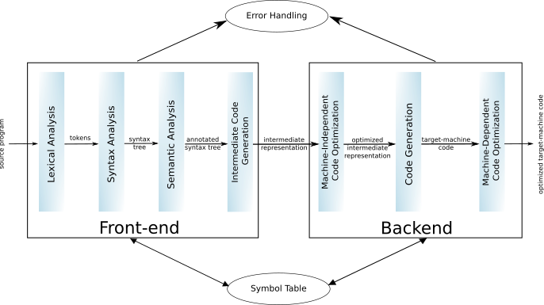

# MiniJava Compiler
  

This project is an implementation of a Java compiler using *Flex* & *Bison*.


For reasons of simplification the grammar was restricted to the following :

```
 Program ::= MainClass ( ClassDeclaration )* <EOF>
 MainClass ::= "class" Identifier "{" "public" "static" "void" "main" "(" "String" "[""]" Identifier ")" "{" Statement "}" "}"
 ClassDeclaration ::= "class" Identifier ( "extends" Identifier )? "{" ( VarDeclaration )* ( MethodDeclaration )* "}"
 VarDeclaration ::= Type Identifier ";"
 MethodDeclaration ::= "public" Type Identifier "(" ( Type Identifier ( "," Type Identifier )* )? ")""{" ( VarDeclaration )* ( Statement )* "return" Expression ";" "}"
 Type ::= "int" "[" "]"
        | "boolean"
        | "int"
        | Identifier
 Statement ::= "{" ( Statement )* "}"
            | "if" "(" Expression ")" Statement "else" Statement
            | "while" "(" Expression ")" Statement
            | "System.out.println" "(" Expression ")" ";"
            | Identifier "=" Expression ";"
            | Identifier "[" Expression "]" "=" Expression ";"
 Expression ::= Expression ( "&&" | "<" | "+" | "-" | "*" ) Expression
            |  Expression "[" Expression "]"
            |  Expression "." "length"
            |  Expression "." Identifier "(" ( Expression ( "," Expression )* )? ")"
            |  <INTEGER_LITERAL>
            |  <BOOLEAN_LITERAL>
            |  Identifier
            | "this"
            | "new" "int" "[" Expression "]"
            | "new" Identifier "(" ")"
            | "!" Expression
            | "(" Expression ")"
 Identifier ::= <IDENTIFIER>
```
### Requirements
* Bison v3.5+ 
* Flex v2.6+
* IntelliJ IDEA

### Compiler Design
A compiler consists of two parts: an ***analysis*** part (or *front-end* of the compiler) and a ***synthesis*** part (or *backend*).

The analysis phase breaks up a source program into constituent pieces and produces an intermediate representation for it. While the synthesis phase translates the intermediate code into the target program.




* Front-end : <br>
The front-end can be divided into the following phases : 

    * **Lexical analysis** : <br>
      The lexical analyzer (or lexer) *scans* the source code as a *stream of characters* and groups the characters into *lexemes* by identifying tokens. These tokens are defined by *regular expressions* understood by the lexer.
  
      For each lexeme, the lexer produces as output a token of the form :
      `<token-name, attribute-value>` which it adds to the symbol table before sending it to the next phase.
  
      It also *removes comments and white space* and identifies tokens which are not a part of the language (i.e. lexical errors e.g., illegal identifiers).

    * **Syntax analysis** : <br>
  The syntax of a programming language describes the *proper form* of its programs. So the syntax analysis is all about checking whether the source code follows the expected format or not i.e. checking whether it is *syntactically correct or not*. 
    
        The parser takes the *tokens* produced by lexical analysis as input and uses ***Context-Free Grammar*** to construct a hierarchical structure known as a *parse tree* (or syntax tree) as output.
    
      *Syntax errors* can be detected and reported at this level if an expression is not in accordance with the grammar.

    * **Semantic analysis** :
	
      The semantics of the language defines *what its programs mean*. So the semantic analysis is all about checking whether or not *the components of the source program are meaningful*. 
  
      It takes the *syntax tree* produced by the syntax analysis phase along with the *symbol table* as input to verify that the given source code is semantically consistent and construct an *annotated tree syntax* as output. 

      *Semantic errors* can be detected and reported at this level (e.g. assignment of values between incompatible data types, identifiers not declared before use, functions called with improper arguments etc.).

    * **Intermediate code generation** :
	
       In this phase, the compiler uses the *semantic representation of the source program* to generate *intermediate code* (e.g. three address codes). 
  
	   Intermediate code represents a program for some *abstract machine* i.e. it is platform-independent. So to build a new compiler for the same source language and a different target machine, we don't need to restart the process from scratch. We can take the intermediate code from the already existing compiler and rebuild the backend part (the platform-dependent part).


* Backend :
  
    * **Code optimization** : 
      
      In the code optimization phase, the compiler transforms the intermediate code *without altering its meaning* in order to *consume fewer resources (CPU, memory)* and *run faster*. It typically removes the unnecessary lines of the code and arranges the sequence of statements
      
      The code optimization can be machine-dependent or machine-independent.

    * **Code generation** :

      In this phase, the code generator takes the optimized representation of the intermediate code as input and converts it into relocatable machine code that is dependent on the type of the target machine's assembler. 
     
      It also performs register allocation, instruction selection, memory locations allocation, etc.

### Credits
The Graphical user interface was adopted with some modifications from [ 
Amos Chepchieng ](https://github.com/k33ptoo/javafx-sample-dashboard).

### Useful resources
* [Compilers: Principles, Techniques, & Tools](https://www.amazon.com/Compilers-Principles-Techniques-Tools-2nd/dp/0321486811) by Alfred V. Aho, Monica S. Lam, Ravi Sethi, and Jeffrey D.
